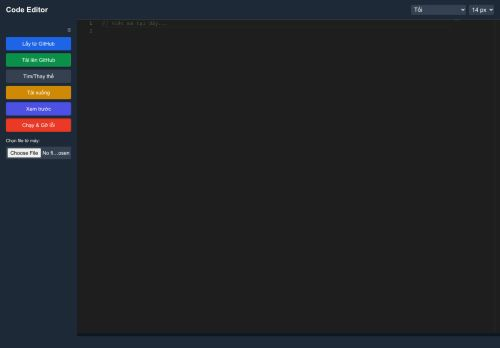

# 🧑‍💻 Sample Code Editor



Trình soạn thảo mã nguồn trực tuyến tích hợp GitHub, hỗ trợ chạy mã trực tiếp và xem trước HTML/Markdown – tất cả trong trình duyệt.

🔗 Truy cập trực tiếp: [TẠI ĐÂY](https://phucnguyencongnghe.github.io/)

---

## ✨ Tính Năng Nổi Bật

### 🖥️ Monaco Editor
- Giao diện tương tự Visual Studio Code.
- Hỗ trợ nhiều ngôn ngữ lập trình.
- Tự động hoàn thành mã và snippet thông minh.

### 🔗 Tích Hợp GitHub
- Kết nối trực tiếp với GitHub.
- Lấy mã nguồn từ repository hoặc tải file từ máy.
- Bảo mật và dễ sử dụng.

### 👀 Xem Trước HTML/Markdown
- Hiển thị kết quả HTML và Markdown ngay lập tức.
- Phù hợp viết tài liệu, demo web, học lập trình.

### 🚀 Chạy & Gỡ Lỗi
- Thực thi mã JavaScript trong trình duyệt.
- Hiển thị lỗi rõ ràng, hỗ trợ debug nhanh chóng.

### 📂 Mở & Lưu File
- Cho phép mở file từ máy tính.
- Lưu nội dung đã chỉnh sửa trực tiếp.

### 🎨 Tùy Chỉnh Giao Diện
- Hỗ trợ theme sáng/tối.
- Tùy chỉnh font chữ và giao diện làm việc.

---

## 🤝 Hướng dẫn đóng góp

Chúng tôi hoan nghênh mọi đóng góp từ cộng đồng! Để đóng góp:

1. Fork repository này.
2. Tạo một nhánh mới (`git checkout -b feature-xyz`).
3. Commit thay đổi của bạn (`git commit -m 'Thêm tính năng XYZ'`).
4. Push nhánh lên (`git push origin feature-xyz`).
5. Mở Pull Request mô tả chi tiết về thay đổi của bạn.

---

## 🛠️ Cài Đặt & Sử Dụng

1. Clone repository:

```bash
git clone https://github.com/phucnguyencongnghe/sample-editor-code.git

